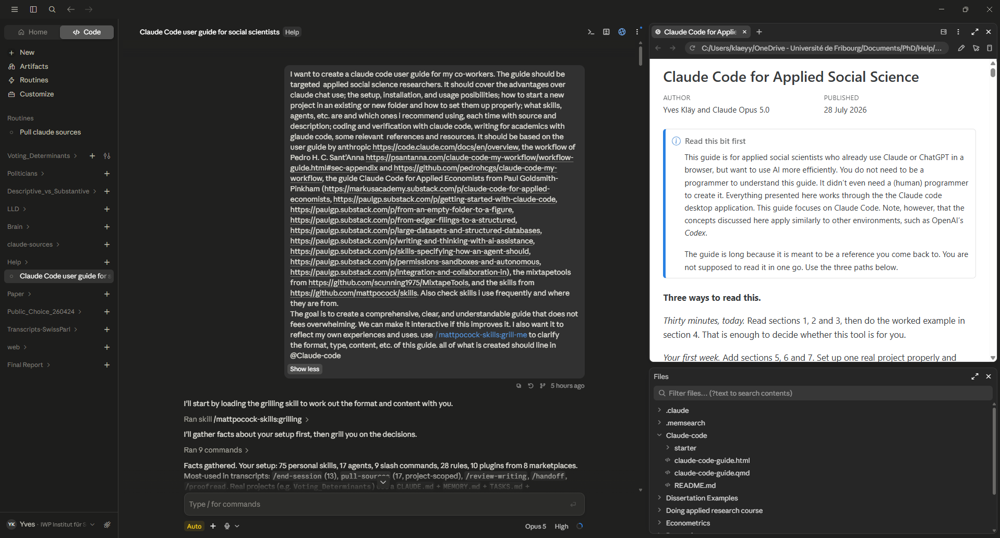

```{=html}
<style>
body { font-family: -apple-system, "Segoe UI", Roboto, "Helvetica Neue", sans-serif; }
h1, h2, h3, h4 { font-weight: 600; letter-spacing: -0.01em; }
h2 { margin-top: 2.4rem; padding-top: 0.6rem; border-top: 1px solid #e4e7eb; }
#TOC { font-size: 0.9rem; }
table { font-size: 0.94rem; }
table td { vertical-align: top; }
main table { display: block; overflow-x: auto; max-width: 100%; }
div.sourceCode { overflow-x: auto; }
img { max-width: 100%; height: auto; }
.callout { margin: 1.4rem 0; }
details { background: #444; border: 1px solid #e4e7eb; border-radius: 6px;
          padding: 0.8rem 1.1rem; margin: 1.2rem 0; }
details summary { font-weight: 600; cursor: pointer; }
details[open] summary { margin-bottom: 0.8rem; }
blockquote { border-left: 3px solid #b68235; color: #000000; font-style: normal; }
code { font-size: 0.9em; }
.reach { color: #555; }
</style>
```
::: {.callout-note appearance="simple"}
## Read this first

This guide is for applied social scientists who already use Claude or ChatGPT in a browser, but want to use AI more efficiently. You do not need to be a programmer to understand this guide. It didn't even need a (human) programmer to create it. Everything presented here works through the the Claude code desktop application. 

This guide focuses on Claude Code. Note, however, that the concepts discussed here apply similarly to other environments, such as OpenAI's *Codex*. 

The guide is based, among others,on 

- [Anthropic's official Claude Code documentation](https://code.claude.com/docs/en/overview)
- [The Mini-Series ``Claude Code for applied economists'' by Goldsmith-Pinkham, Associate Professor of Finance at Yale](https://markusacademy.substack.com/p/claude-code-for-applied-economists)
- [The Claude Code Setup by Pedro H. C. Sant'Anna, Associate Professor of Economics at Emory University](https://psantanna.com/claude-code-my-workflow/workflow-guide.html)

It is long because it is meant to be a reference you come back to. You are not supposed to read it in one go. Use the three paths below.
:::

**Three ways to read this.**

*Thirty minutes, today.* Read sections [1](#why-claude-code-and-not-claude-chat), [2](#what-it-gets-wrong-and-why-you-must-verify) and [3](#setup), then do the worked example in section [4](#your-first-session). That is enough to decide whether this tool is for you.

*Your first week.* Add sections [5](#setting-up-a-project), [6](#the-building-blocks) and [7](#skills-and-agents-worth-installing). Set up one real project properly and install a handful of the recommended skills.

*Later, when something annoys you.* Sections [8](#coding-and-verification) to [10](#what-it-costs) cover verification, writing, and what it costs. Come back when you hit the problem each one solves.

Everything referenced here lives alongside this file in the `starter/` folder. [The Appendix](#appendix-the-bootstrap-prompt) has the one prompt you can paste to set up a new project from scratch.

# Why Claude Code and not Claude chat

The difference is not that one model is smarter. It is the same model. The difference is that Claude Code can see your files and run your code, and chat cannot.

Think about what happens today when you ask Claude in a browser to clean a messy dataset. You describe, or maybe upload, the file to chat. Claude writes some R code. You copy the code into RStudio, run it, and get an error on line 14 because a column is a character when Claude assumed it was numeric. You copy the error back into the browser. Claude apologises and rewrites the code. You copy it again. Round and round. The same inefficient loop can be observed in writing tasks, empirical analyses, visualization generation, etc. 

Claude Code closes that loop. It writes the script into your project folder, runs it, reads the error itself, fixes the column type, runs it again, and tells you when the cleaned file is ready. You were not involved in any of the copying. More to the point, Claude saw the actual data rather than your description of it, so it knew the column was a character in the first place.

That single change has some consequences worth spelling out.

**It can check its own work.** A model that cannot run code has to guess whether the code works. A model that can run code knows. This is the whole reason the tool is worth learning.

**It sees the project, not the snippet.** When you ask why a regression has 4,102 observations instead of 4,300, Claude can open the cleaning script, the merge, and the raw file, and trace where 198 rows went. In chat you would have to keep track of all steps and then paste all three and hope you pasted the right parts.

**The work persists.** Scripts, notes, and decisions end up as files in your folder. When you come back in three weeks the project remembers what it is. A chat conversation does not. That’s a problem, because often even we—or certainly our co-authors—don’t remember exactly what was done, when, and how. 

**You can teach it your standards once.** A file called `CLAUDE.md` in your project folder together with personalized rules are read at the start of every session. Put your conventions in it and you stop repeating yourself. Section [6](#the-building-blocks) covers this.


# What it gets wrong, and why you must verify

I have put this before the setup instructions on purpose. AI makes mistakes, and the mistakes are often subtle. You cannot trust the output without checking it. The model is not malicious, but it is trained to produce something that looks finished rather than something that is correct.

When I started my PhD in 2023, coding and data analyses in general were the bottlenecks. Today, verification is the new bottleneck. The model produces results faster than you can check them, and the checking has not got any faster. This is an important limitation, but if you're aware of it, you can develop strategies to minimize these errors. 

## Code that looks right and never ran

The most common failure. You ask for a regression table. You get a beautiful table. The numbers are plausible. The stars are in sensible places. The code never executed, and the numbers came from the model's sense of what such a table usually looks like.

This happens more when you ask for the output than when you ask for the script. Ask for the script, then ask it to run the script, then look at the console output yourself.

## Observations that disappear at a merge

You ask Claude to merge two datasets, for example from two survey waves that were carried out in different years. A merge drops rows. The model reports success. Nobody mentions that the sample fell from 12,400 to 9,880 because the person identifiers were zero-padded in one file and not the other.

The defence is a habit rather than a tool. After every merge, ask for the row count before and after, and for the number of unmatched records on each side. You can turn such simple, as well as more sophisticated, verifications into rules so you do not have to remember. The `starter/` folder has one.

## Invented citations

Ask for the literature on a topic and you will sometimes get a reference that does not exist, with a real author, a real journal, a plausible title, and a fabricated year and volume. This is the failure that will actually damage your reputation, because a wrong coefficient is your mistake and a fake citation looks like fraud.

Never let a citation into a draft that you have not opened yourself. The `validate-bib` skill in section [7](#skills-and-agents-worth-installing) checks a bibliography against the real record, but the final responsibility is yours. Note that AI has gotten much better at literature review since in recent years, but it is still not perfect. Always verify the references.

## Econometrics that is confidently wrong

Clustering at the wrong level. Weights ignored. Fixed effects that absorb the variation you wanted to study. Standard errors that do not account for the two-stage procedure that generated the regressor. The model writes fluent, well-commented code that implements the wrong estimator.

It is good at syntax and much weaker at judgement. Treat its econometric choices the way you would treat a first-year RA's: check the specification yourself, every time.

Such errors can be avoided by establishing rules specifying which R, Stata, or Python packages should be used for which analyses. 

## It agrees with you

If you say "I think the effect should be positive", the model becomes more likely to find reasons the effect is positive. If you push back on a correct answer, it will often fold. This is a real problem for a solo researcher, because the tool that is supposed to catch your errors is inclined to agree with them.

Two defences. Ask questions neutrally, so instead of "isn't this specification better?" ask "compare these two specifications". And use a fresh reviewer that has not seen the conversation, which is what subagents are for. Section [8](#coding-and-verification) covers this.

## Word documents

Claude Code can directly read plain text, markdown, source code, and configuration files, but it cannot natively read binary formats like .docx. Claude Code can convert a `.docx` to text through Pandoc, edit the text, and convert it back. The round trip works, but it loses track changes, comments, and most formatting. 

You get most of the benefit only once your manuscripts lives in a text format, meaning LaTeX, Quarto, or plain Markdown. I know that is a big ask for someone with three co-authors and a Word file. Section [9](#writing) says what you can still do without switching, and section [8](#coding-and-verification) explains what you gain if you do.

## Underneath all of it

The model is trained to produce something that looks finished. A finished-looking answer scores better than "I could not work this out". So when it does not know, it does not stop. It produces the most plausible thing.

Two rules that follow from this. **Never accept a number you did not watch being produced.** And **when it says it is done, that is a claim, not a fact.**

# Setup

There are several ways to run Claude Code. I find the desktop app the most intuitive. See, [Anthropic's Quickstart Guide](https://code.claude.com/docs/en/quickstart) for more details.

## The desktop app (start here)

A normal application with a window, buttons, and a visual view of what changed. No terminal.

- [Download for Windows](https://claude.ai/api/desktop/win32/x64/setup/latest/redirect)
- [Download for macOS](https://claude.ai/api/desktop/darwin/universal/dmg/latest/redirect) (Intel and Apple Silicon)

Install it, sign in with the Claude account you already have, and click the **Code** tab. You will be asked to pick a folder. That folder is the project. **Claude can see everything inside it and nothing outside it.**

The desktop app also shows you changes as a visual diff, side by side, before you accept them. For someone learning what the tool actually does to their files, this is worth a great deal.

{fig-alt="Screenshot of the Claude Code desktop application showing the project sidebar, a conversation thread, a rendered HTML preview, and a file browser."}

Three things to find when you first open it. The **project list** on the left, where each folder you have worked in appears. The **conversation** in the middle, where you type. And the **panel on the right**, which shows files, diffs, and previews as Claude works on them.

## VS Code

If you already use VS Code or Cursor, install the Claude Code extension from the Extensions panel (`Ctrl+Shift+X` on Windows, `Cmd+Shift+X` on Mac). You get inline diffs in the editor and can reference files with `@`.

RStudio does not have an extension. If you work in RStudio, run the desktop app next to it. Claude edits the files, RStudio picks up the changes when you save.

## The terminal

The original interface and still the most capable. Worth learning eventually, not on day one.

::: {.callout-note collapse="true"}
## Never used a terminal? Open this.

A terminal is a window where you type commands instead of clicking. On Windows it is called PowerShell or Command Prompt, and you open it by pressing the Windows key and typing "PowerShell". On a Mac it is called Terminal, and you open it with `Cmd+Space` then typing "Terminal".

When it opens you see a line ending in `>` or `$`. That is the prompt. It is waiting. Whatever you type gets run when you press Enter.

The terminal is always "in" a folder, and commands apply to that folder. `cd` means change directory. So `cd Documents\MyProject` moves into that folder.

To install Claude Code, open PowerShell and paste this, then press Enter:

```powershell
irm https://claude.ai/install.ps1 | iex
```

On a Mac or Linux, open Terminal and paste this instead:

```bash
curl -fsSL https://claude.ai/install.sh | bash
```

Then move into your project folder and start it:

```bash
cd path/to/your/project
claude
```

On Windows it also helps to install [Git for Windows](https://git-scm.com/downloads/win), which gives Claude Code a better shell to work with.

Nothing here can break your computer. The worst that happens is a command fails and prints red text.
:::


## What you need to pay for

A Claude Pro or Max subscription, or an Anthropic Console account billed per token. If you already pay for Claude in the browser, you already have access. Section [10](#what-it-costs) covers which plan makes sense.

# Your first session

Twenty minutes, no data of your own, nothing that can go wrong. The point is to see the rhythm.

**Make an empty folder** somewhere sensible, called `claude-test`. Open the desktop app, click Code, and choose that folder.

**Type this:**

> I want to look at the relationship between GDP per capita and life expectancy across countries. Download the most recent year of both series from the World Bank for all countries, save the raw data as CSV, and make a scatter plot with a fitted line. Use R. Before you start, show me your plan.

Three things to notice in what comes back.

**It plans first.** Because you asked, it lays out the steps before touching anything: find the World Bank indicator codes, download, merge, plot. Read the plan. This is the cheapest moment to catch a misunderstanding. If it plans to use the wrong indicator, say so now rather than after three scripts exist.

**It asks permission.** The first time it wants to write a file or run a command, you get a prompt. Read the first few properly so you learn what it is doing. Once the novelty wears off, the `permissions` list in `.claude/settings.json` is how you stop being asked about routine things. The starter kit ships one.

**It recovers on its own.** Something will go wrong. A URL will 404, a package will be missing, a column will have an unexpected name. Watch it read the error and try something else. You do not need to intervene.

When it says it is finished, do the verification. This is the habit the whole guide is built around.

> How many countries are in the final plotted data, and how many were dropped for missing values? Show me the first ten rows of the file you plotted.

Then open the CSV yourself and look at it.

**Now try one more thing.** Ask for a change:

> Colour the points by region and put the x-axis on a log scale.

Notice it edits the existing script rather than writing a new one, and re-runs it. That is the loop. Describe, it acts, you check, you refine.

::: {.callout-important}
## What you just learned
Plan before acting. Watch the run rather than the summary. Check the sample size. Ask for changes in small steps. Everything else in this guide is detail on top of those four habits.
:::

# Setting up a project

A project is a folder. Claude Code sees everything in it and nothing above it. Getting the folder right at the start saves a lot of pain later.

## A new project

Make an empty folder, open it in Claude Code, and paste the bootstrap prompt from [the Appendix](#appendix-the-bootstrap-prompt). It creates the structure, the instruction files, and the rules, and it takes about a minute.

## An existing project

You can point Claude Code at a folder that already has years of work in it. Do two things first.

**Back it up.** Copy the folder, or make sure OneDrive or Dropbox has it. This is a five-minute insurance policy against a bad afternoon.

**Let it read before it writes.** Open the folder and start with a question rather than an instruction:

> Read this project and describe what it does. What are the data sources, what does each script do, in what order do they run, and what looks broken or inconsistent?

The answer is useful in itself. It also gives you a way to test whether the model has understood the project before you let it change anything. Then run the bootstrap prompt, which adds the instruction files without touching your existing work.

## The folder structure

Nothing exotic. The point is that every file has one obvious home.

```markdown
my-project/
  CLAUDE.md            instructions Claude reads every session
  MEMORY.md            things learned that should survive
  CHANGELOG.md         what changed, and when
  TASKS.md             what is next
  README.md            what this project is
  .gitignore
  .claude/
    settings.json
    rules/             conventions, loaded automatically
  data/
    raw/               never edited, never overwritten
    clean/             produced by scripts, safe to delete
  scripts/
    01_download.R
    02_clean.R
    03_analyse.R
    _outputs/          tables and figures the scripts produce
  paper/
    main.tex
  docs/                notes, PDFs, correspondence
```

Two things carry most of the weight. `data/raw/` is sacred and nothing writes to it. And scripts are numbered, so the order they run in is visible from the filenames rather than remembered.

## The four files

These are the project's memory. They are plain Markdown and you can edit them by hand at any time.

**`CLAUDE.md`** is read at the start of every session. It holds the standing instructions: what the project is, which language, where things go, what conventions to follow, what never to do. Keep it under a hundred lines. It is loaded every single time, so anything vague in it costs you on every request.

**`MEMORY.md`** is the accumulated learning. "The 2015 wave uses a different person coding, converted in `02_clean.R`." "The Stata `.dta` export needs `version 13` for co-authors." Things that took effort to work out and would be annoying to work out twice.

**`CHANGELOG.md`** is what changed and when. Dated entries, newest first. It answers "why does this variable exist" six months later, and it is the file you let claude skim when you come back to a project after a semester away.

**`TASKS.md`** is the to-do list. Its real value is at the end of a session, when you write down what you were about to do next. The `end-session` skill in section [7](#skills-and-agents-worth-installing) fills all of these in for you.

## Make it a git repository

Do this on day one, even if you have never used git and have no intention of learning it. Claude Code will handle it for you.

> Turn this project into a git repository, add a sensible .gitignore that excludes data files and outputs, and make an initial commit.

Three reasons, in order of how much they matter.

**You can see exactly what changed.** Git shows you a diff, meaning the specific lines that were added and removed. This turns reviewing the model's work from an impossible task into a manageable one. Nobody can meaningfully review 800 lines of new code, but everybody can review the 30 lines that changed since the version they already checked.

**You can go back.** When something breaks and you cannot work out why, you return to the last state that worked. This matters more with an AI assistant than without one, because it makes larger changes faster than you can follow them.

**It is the safety net that lets you relax the permissions.** Approving every single action gets old fast, and the danger is that you start clicking yes without reading. Widening the allow list is only sensible if mistakes are reversible, and git is what makes them reversible.

Pushing to GitHub adds off-machine backup, a place to see the project from another computer, and issues, which are a good way to leave a note for both your co-author and the model. Private repositories are free.

See [Episode 8: Integration and collaboration](https://paulgp.substack.com/p/integration-and-collaboration-in) from Goldsmith-Pinkham's Mini-Series for more on how to use git with Claude Code.

::: {.callout-warning}
## One thing to get right
`.gitignore` should exclude your data. Not because of any rule, but because git handles large binary files badly and your repository will become unusable. Data lives in OneDrive or a data repository. Code and text live in git.
:::

# The building blocks

Claude Code is customised through plain text files in a folder called `.claude`. There is no settings dialogue and no database. Everything is a Markdown or JSON file you can open, read, and edit. Once that clicks, the rest is easy.

## Where things live

This is the part that confuses people first, so it goes first.

There are multiple `.claude` folders, and the difference is scope.

| Location | Loads in | Use it for | Who has access |
|---|---|---|---|
| `~/.claude/` on Mac, `C:\Users\<you>\.claude\` on Windows | **Every project** | Skills, agents, and conventions you want everywhere |You|
| `<project>/.claude/` | **That project only** | Anything specific to this paper or dataset |Everybody with access to the project|

Both folders have the same shape, so `skills/`, `agents/`, `commands/`, `rules/`, `hooks/` and `settings.json` can appear in either. When both exist, the project version is used.

This implies that generic skills and rules that you most likely use across multiple projects go in your user folder. Anything that encodes a decision specific to one project goes in that project's folder. Note that if you work with co-authors on a project, you may still want to include them in the project folder, so everybody uses the same conventions and skills.

::: {.callout-tip}
## The most common early confusion
"My skill has disappeared." It has not. You installed it in a project folder and then opened a different project. Check which `.claude` folder it is in.
:::

## CLAUDE.md and memory

`CLAUDE.md` is the standing instruction file, covered in section [5](#setting-up-a-project). There is also one at `~/.claude/CLAUDE.md` that applies to everything you do, which is a good place for personal preferences that never change.

Claude Code additionally builds its own memory as it works, recording things like the command that builds your project. You do not need to manage this.

## Rules

A rule is a Markdown file in `.claude/rules/` holding one convention. Rules are how you stop repeating yourself.

They come in two kinds. Always-on rules load in every session, so keep those short. Path-scoped rules load only when a matching file is touched, declared in a small header at the top:

```markdown
---
paths:
  - "scripts/**/*.R"
---

# Example rule

- ...
```

As an example, see my session logging rule. It makes sure I keep track of what was done when and why.

````markdown
# Session logging

Context gets compressed and conversations get lost. Files do not.

## Three moments

**After a plan is approved.** Write the goal, the approach, and why that approach, to `docs/session_logs/YYYY-MM-DD_description.md`.

**During work.** Append one or two lines whenever a decision is made, a problem is solved, or the approach changes. Do not batch this to the end. The reason a choice was made is the thing that gets forgotten first.

**At the end.** Summary of what was done, what is unresolved, and what the next session should start with. Update `TASKS.md`, `MEMORY.md`, and `CHANGELOG.md` to match.

## What belongs where

| File | Holds |
|---|---|
| `docs/session_logs/` | What happened on a given day, and why |
| `MEMORY.md` | Learnings that stay true across sessions |
| `CHANGELOG.md` | Dated record of what changed in the project |
| `TASKS.md` | What is next |

`MEMORY.md` is for things that were hard to work out and would be annoying to work out twice. Coding quirks in a data wave. A package version that breaks something. The reason a variable is constructed the way it is. Not a diary.

## Format

Session log:

```markdown
# 2026-07-28 — Merge diagnostics

**Goal:** Work out why the municipality merge loses 198 rows.

**Found:** 2015 wave pads identifiers to 4 digits, earlier waves do not.

**Decision:** Normalise in 02_clean.R rather than at the merge, so
every downstream user gets the fixed version.

**Next:** Re-run 03 onwards and check the sample is 12,400 again.
```


Short is fine. Written down is the point.


````

The `starter/` folder has thirteen rules. Ten cover the workflow: planning, verification, quality gates, session logging, replication tolerances, proofreading, inference and robustness, tracing paper claims back to the code that produced them, checking a draft's factual claims before it reaches you, and keeping every number in one place. The other three are coding conventions for R, Stata, and Python, so delete the two you do not use.

Read them and delete anything else you disagree with. A rule you do not believe in is worse than no rule, because you will start ignoring the output that enforces it.

## Skills

A skill is a folder containing a `SKILL.md` file that describes a repeatable procedure. A skill specifies *how an agent should think* about a recurring task. It is not automation. It is your own judgement, written down once. See Goldsmith-Pinkham's [Skills Overview](https://paulgp.substack.com/p/skills-specifying-how-an-agent-should) for more details.

The file has a short header and then instructions in plain English:

::: {.callout-note collapse="true"}
## Example: the full `review-paper` skill (long, click to expand)

````markdown
---
name: review-paper
description: Comprehensive manuscript review with three modes: single-pass (default), --adversarial critic-fixer loop, and --peer [journal] simulated peer-review pipeline (editor + 2 dispositioned referees + editorial decision, calibrated to a target journal). R&R continuation via --peer --r2/--r3; hostile-editor stress test via --peer --stress; reviewer-disposition variance reporting via --peer --variance N. Auto-invokes /review-r + /audit-reproducibility on referenced scripts unless --no-cross-artifact.
argument-hint: "[paper path] [--adversarial | --peer <journal> [--r2 | --r3 | --stress | --variance N] [--no-novelty-check]] [--no-cross-artifact]"
allowed-tools: ["Read", "Grep", "Glob", "Write", "Edit", "Bash", "Task"]
---

# Manuscript Review

Produce a thorough, constructive review of an academic manuscript — the kind of report a top-journal referee would write.

> **Which review skill do I want?**
>
> - **`/review-paper`** (this skill) — single comprehensive report, optional `--adversarial` critic-fixer loop, or `--peer <journal>` simulated peer-review pipeline. Best for **most drafts**.
> - **`/seven-pass-review`** — seven independent lenses in parallel (abstract, intro, methods, results, robustness, prose, citations) then synthesized. Heavier (7× token cost). Best for **submission-ready drafts** or **R&R stage** where you need maximum coverage.
> - **`/respond-to-referees`** — if you already have referee comments and need a response document, not another review.
> - **`/slide-excellence`** — for lecture slides, not papers.

**Input:** `$ARGUMENTS` — path to a paper (`.tex`, `.pdf`, or `.qmd`), or a filename in `master_supporting_docs/`. Optional flags:

- `--adversarial` — critic-fixer loop (max 5 rounds).
- `--peer <JOURNAL>` — simulated peer review pipeline calibrated to `<JOURNAL>` (see `.claude/references/journal-profiles.md` for available short names).
- `--r2` / `--r3` — R&R continuation mode (requires `--peer`). Reloads prior round, classifies concerns Resolved / Partial / Not addressed.
- `--stress` — hostile-editor stress test (requires `--peer`). Forces SKEPTIC dispositions, doubles critical peeves.
- `--variance` (followed by integer **N**, default 3) — reviewer-disposition variance mode (requires `--peer`). Runs **N** referees with **independently sampled** dispositions from the 6-way taxonomy. Editor aggregates into a **decision distribution**, not a point estimate. Mutually exclusive with `--stress` and `--r2`/`--r3`.
- `--no-novelty-check` — skip editor's WebSearch novelty probe (default is ON).
- `--no-cross-artifact` — skip auto-invocation of `/review-r` + `/audit-reproducibility` on referenced scripts.

> **Already received referee comments?** Use [`/respond-to-referees`](../respond-to-referees/SKILL.md) instead. That skill cross-references each referee concern against the revised manuscript and drafts a complete response document.

---

## Modes

### Default mode (single-pass)

One comprehensive review report. Fast, low token cost, suitable for early drafts where the author wants feedback and will iterate manually.

### Adversarial mode (`--adversarial`)

Iterative critic-fixer loop modeled on [`/qa-quarto`](../qa-quarto/SKILL.md). The critic identifies issues, the fixer proposes and applies edits (with user approval), and the critic re-audits. Loops until APPROVED or max 5 rounds.

Use when: preparing a pre-submission draft, responding to a journal-desk rejection with substantive revisions, or after your own major rewrite. Costs more tokens but produces a manuscript the critic has signed off on.

### Peer-review mode (`--peer <JOURNAL>`)

Simulated editorial pipeline: **editor desk review → referee selection → 2 blind referees with different dispositions → editorial synthesis**. Calibrated to a target journal from `.claude/references/journal-profiles.md`. Use when: pre-submission dress rehearsal, choosing between target journals, R&R planning.

This mode is materially different from `--adversarial`: adversarial runs the same critic 5× with fresh context; `--peer` runs **different personas** (editor + 2 dispositioned referees drawn from 6-way taxonomy: STRUCTURAL / CREDIBILITY / MEASUREMENT / POLICY / THEORY / SKEPTIC) whose priors are *deliberately different* and who are blind to each other.

**Agents used** (all reimplemented in this template; adapted from [Hugo Sant'Anna's clo-author](https://github.com/hugosantanna/clo-author) with permission):

- `.claude/agents/editor.md` — editor (desk review, referee selection, synthesis).
- `.claude/agents/domain-referee.md` — substance referee.
- `.claude/agents/methods-referee.md` — methodology referee (paper-type-aware).

**Sub-flags:**

- `--r2` / `--r3` — R&R mode. Skips fresh desk review; reloads prior round's reports; same referees + dispositions + peeves; classifies each prior concern as Resolved / Partial / Not addressed. Hard cap at `--r3` (no round 4+).
- `--stress` — Hostile editor. Forces both referees to SKEPTIC disposition, doubles critical peeves, framing: "you are looking for reasons to reject this paper." Output is a concern-list gauntlet, not a decision letter.
- `--variance` (with integer **N**, default 3) — Reviewer-disposition variance mode. Runs **N** referees with **independently sampled** dispositions from the 6-way taxonomy (STRUCTURAL / CREDIBILITY / MEASUREMENT / POLICY / THEORY / SKEPTIC). Editor synthesizes into a **distribution of decisions**, not a single verdict. See "Variance mode" below.
- `--no-novelty-check` — Disables the editor's WebSearch novelty probes (default is ON). Use in offline or hallucination-sensitive contexts. **Novelty-check caveat (document this to users):** WebSearch can return hallucinated citations or miss paywalled recent work. Always surface novelty-probe results as flags for manual verification, not verdicts.

#### Variance mode (`--peer --variance N`)

**Why this mode exists.** Default `--peer` runs an editor + 2 referees with dispositions sampled once. A single peer-review pass is a point estimate of how the paper would fare — but the AgentReview ACL 2024 study ([arXiv:2406.12708](https://arxiv.org/abs/2406.12708)) found that **~37% of paper decisions vary purely from reviewer-disposition sampling** and another 27.7% from partial author-identity disclosure. A point estimate hides this variance.

Variance mode runs N independent referees (default N=3, max N=5 for token-cost discipline) with disposition sampling, then reports a **decision distribution** that surfaces this variance to the author.

**How it works:**

1. Editor performs desk review once (shared across the N referees).
2. The editor samples N dispositions from the 6-way taxonomy **with replacement**. Stratification rule: if N ≥ 3, at least one SKEPTIC is always sampled (avoids drawing N friendly referees by chance).
3. Each of the N referees runs in an isolated context (`Task` with `context: fork`) — same manuscript, same paper-type rubric, different disposition. Referees are blind to each other.
4. Editor receives N independent reports and produces:
   - A **decision-distribution table** (e.g., `2/3 R&R, 1/3 Reject` with the modal verdict highlighted).
   - A **concern-frequency table** showing which concerns appeared across multiple referees (high frequency = robust criticism; low frequency = disposition-dependent).
   - An **editorial recommendation** that explicitly references the variance ("modal verdict R&R, with one SKEPTIC dissent on identification — author should address the identification concern even though it's not the majority position").

**Output files:**

- `quality_reports/peer_review_<paper>/referee_1.md` … `referee_N.md` (per-referee reports)
- `quality_reports/peer_review_<paper>/decision_distribution.md` (aggregate table + concern-frequency analysis)
- `quality_reports/peer_review_<paper>/editor_synthesis.md` (final editorial letter)

**Cost discipline.** Variance mode multiplies referee-tier cost by N relative to default `--peer` (which runs 2 referees). The Cost-Conscious Composition section of the workflow guide recommends keeping referees on Sonnet (mid-tier) for variance runs and reserving Opus for the editor synthesis. Hard cap at N=5; for higher variance estimates, run `--variance 5` twice and combine offline.

**Mutual exclusivity.** Variance mode cannot combine with `--stress` (which forces SKEPTIC×2 and would defeat the sampling purpose) or `--r2`/`--r3` (which reuses prior-round dispositions for continuity). The skill halts with an error if mutually-exclusive flags are combined.

**When to reach for it:**

- Pre-submission dress rehearsal where you want to know not just "will this paper survive review" but "*how confidently* will it survive."
- Deciding between target journals — run `--variance 3` against two journal profiles, compare distributions.
- Responding to a rejection where the referee panel felt unrepresentative — `--variance 5` against the same journal profile gives an empirical sense of whether the original referees were typical.

---


## Steps (both modes)

1. **Locate and read the manuscript.** First strip flags (`--adversarial`, `--no-cross-artifact`) from `$ARGUMENTS` to get the bare manuscript path. Check:
   - Direct path (bare path from step 1)
   - `master_supporting_docs/supporting_papers/$ARGUMENTS`
   - Glob for partial matches

2. **Read the full paper** end-to-end. For long PDFs, read in chunks (5 pages at a time).

3. **Evaluate across 6 dimensions** (see below).

4. **Generate 3–5 "referee objections"** — the tough questions a top referee would ask.

5. **Produce the review report.**

6. **Save to** `quality_reports/paper_review_[sanitized_name]_round[N].md` (N=1 in default mode; N increments in adversarial mode).

6b. **Cross-artifact integration.** Unless `$ARGUMENTS` contains `--no-cross-artifact`, and if the manuscript references analysis scripts (detected via `\input{scripts/...}`, `%% source:` comments, or matching `scripts/R/_outputs/` filenames), auto-invoke:
   - `/review-r` on each referenced script (forked subagent, results to `quality_reports/cross_artifact_[paper]/review_r_*.md`)
   - `/audit-reproducibility` on the manuscript + outputs dir (results to `quality_reports/cross_artifact_[paper]/reproducibility.md`)

   Merge critical cross-artifact findings (code bug invalidates paper claim, reproducibility FAIL) into a new "Cross-Artifact Findings" section at the top of the paper review report. See [`.claude/rules/cross-artifact-review.md`](../../rules/cross-artifact-review.md) for the full protocol.

7. **If `--adversarial` is in `$ARGUMENTS`:** invoke the critic-fixer loop defined in the next section. Otherwise stop here.

---

## Review Dimensions

### 1. Argument Structure
- Is the research question clearly stated?
- Does the introduction motivate the question effectively?
- Is the logical flow sound (question → method → results → conclusion)?
- Are the conclusions supported by the evidence?
- Are limitations acknowledged?

### 2. Identification Strategy
- Is the causal claim credible?
- What are the key identifying assumptions? Are they stated explicitly?
- Are there threats to identification (omitted variables, reverse causality, measurement error)?
- Are robustness checks adequate?
- Is the estimator appropriate for the research design?

### 3. Econometric Specification
- Correct standard errors (clustered? robust? bootstrap?)?
- Appropriate functional form?
- Sample selection issues?
- Multiple testing concerns?
- Are point estimates economically meaningful (not just statistically significant)?

### 4. Literature Positioning
- Are the key papers cited?
- Is prior work characterized accurately?
- Is the contribution clearly differentiated from existing work?
- Any missing citations that a referee would flag?

### 5. Writing Quality
- Clarity and concision
- Academic tone
- Consistent notation throughout
- Abstract effectively summarizes the paper
- Tables and figures are self-contained (clear labels, notes, sources)

### 6. Presentation
- Are tables and figures well-designed?
- Is notation consistent throughout?
- Are there any typos, grammatical errors, or formatting issues?
- Is the paper the right length for the contribution?

---

## Output Format

```markdown
# Manuscript Review: [Paper Title]

**Date:** [YYYY-MM-DD]
**Reviewer:** review-paper skill
**File:** [path to manuscript]

## Summary Assessment

**Overall recommendation:** [Strong Accept / Accept / Revise & Resubmit / Reject]

[2-3 paragraph summary: main contribution, strengths, and key concerns]

## Strengths

1. [Strength 1]
2. [Strength 2]
3. [Strength 3]

## Major Concerns

### MC1: [Title]
- **Dimension:** [Identification / Econometrics / Argument / Literature / Writing / Presentation]
- **Issue:** [Specific description]
- **Suggestion:** [How to address it]
- **Location:** [Section/page/table if applicable]

[Repeat for each major concern]

## Minor Concerns

### mc1: [Title]
- **Issue:** [Description]
- **Suggestion:** [Fix]

[Repeat]

## Referee Objections

These are the tough questions a top referee would likely raise:

### RO1: [Question]
**Why it matters:** [Why this could be fatal]
**How to address it:** [Suggested response or additional analysis]

[Repeat for 3-5 objections]

## Specific Comments

[Line-by-line or section-by-section comments, if any]

## Summary Statistics

| Dimension | Rating (1-5) |
|-----------|-------------|
| Argument Structure | [N] |
| Identification | [N] |
| Econometrics | [N] |
| Literature | [N] |
| Writing | [N] |
| Presentation | [N] |
| **Overall** | **[N]** |
```

---

## Principles

- **Be constructive.** Every criticism should come with a suggestion.
- **Be specific.** Reference exact sections, equations, tables.
- **Think like a referee at a top-5 journal.** What would make them reject?
- **Distinguish fatal flaws from minor issues.** Not everything is equally important.
- **Acknowledge what's done well.** Good research deserves recognition.
- **Do NOT fabricate details.** If you can't read a section clearly, say so.

---

## Adversarial Mode — Critic-Fixer Loop

**Only runs if `--adversarial` is in `$ARGUMENTS`.**

Pattern adapted from [`/qa-quarto`](../qa-quarto/SKILL.md), which uses the same loop to iterate on slide quality. Papers get it now because the single-pass review leaves authors doing manual fix-and-resubmit cycles.

### Flow

```
Phase 0: Pre-flight
  │
  ├─ Verify the manuscript compiles (xelatex / quarto render) if applicable
  ├─ Snapshot the pre-review version: git stash OR copy to a .review-backup/
  │
Phase 1: Critic audit (round N=1,2,3,...)
  │
  ├─ Run the default review above, producing a round-N report
  ├─ If the report has ZERO Major Concerns and ZERO Referee Objections
  │  rated "fatal":
  │     → VERDICT = APPROVED. Stop the loop. Write final summary.
  │  Else: continue.
  │
Phase 2: Fixer
  │
  ├─ For each Major Concern in the round-N report, produce a concrete
  │  proposed edit (diff or new text block).
  ├─ Present proposed edits to the user grouped by severity (Critical →
  │  Major → Minor). Ask for approval: "apply all", "apply critical+major
  │  only", "review each", or "abort".
  ├─ Apply approved edits with Edit / Edit tools.
  ├─ If the manuscript is a compile target (`.tex` / `.qmd`), re-compile
  │  and verify it still builds.
  │
Phase 3: Re-audit
  │
  └─ Spawn a FRESH-CONTEXT subagent (via Task, `subagent_type` set to
     general-purpose) to re-read the paper and produce a round-(N+1)
     report. Fresh context prevents anchoring bias — the new reviewer
     sees the edited paper, not the diff.
     → Jump back to Phase 1.
```

### Iteration limits

- **Max 5 rounds.** After round 5, halt regardless of verdict.
- **Fix round limits:** if the same Concern label appears in rounds N and N+2, flag as "author disagreement" and let the user decide (keep-as-is with rationale vs. another fix attempt).
- **Budget escape:** if token cost across all rounds exceeds ~200k, warn and let the user cap further rounds.

### Stopping criteria

| Condition | Action |
|---|---|
| Zero Major Concerns, zero fatal Referee Objections | APPROVED — final summary |
| Max 5 rounds reached | HALTED — list remaining concerns, user decides |
| User approves zero fixes in a round | HALTED — user signals "I disagree with this review" |
| Compile fails after applied fixes | ROLLED BACK to pre-round-N snapshot, report compile error, user decides |

### Final report

After the loop ends, write `quality_reports/paper_review_[sanitized_name]_FINAL.md`:

```markdown
# Final Review: [Paper Title]

**Rounds:** N
**Verdict:** APPROVED | HALTED (max rounds) | HALTED (user override) | ROLLED BACK
**Token cost estimate:** ~XXk

## Round Summary
| Round | Major Concerns | Fatal Objections | Status |
|---|---|---|---|
| 1 | 7 | 2 | Fixed 5, deferred 2 |
| 2 | 3 | 1 | ...              |
| ... | ... | ... | ...         |
| N | 0 | 0 | APPROVED        |

## Changes Applied
[link to git diff between the pre-round-1 snapshot and HEAD]

## Remaining Concerns (if HALTED)
[list with severity + rationale]

## Next Steps
[recommended action: submit / one more pass / substantial revision]
```

### When NOT to use adversarial mode

- Early exploratory drafts (the loop forces premature polish on ideas still being shaped)
- Papers you don't yet have compilable source for (can't verify edits)
- When you'd rather get ONE opinion and decide for yourself (adversarial-mode enforces "critic signed off" semantics — that's sometimes the wrong frame)

---

## `--peer [journal]` workflow detail

### Phase 0: Cross-artifact pre-flight (runs BEFORE desk review in --peer mode)

Unless `--no-cross-artifact` is set, auto-invoke `/audit-reproducibility` on the manuscript + its outputs directory *first*. Any reproducibility FAIL becomes desk-reject-worthy evidence the editor can cite. See `.claude/rules/cross-artifact-review.md`.

Reports: `quality_reports/cross_artifact_[paper]/reproducibility.md`.

**Novelty-probe Post-Flight (new in v1.7.0).** The editor's novelty probe uses `WebSearch` to check whether the paper's contribution has been made before. WebSearch results can be hallucinated — fabricated prior work, misattributed findings, wrong years. Before the editor's desk review incorporates novelty-probe claims into its decision, those claims must pass Post-Flight Verification per [`.claude/rules/post-flight-verification.md`](../../rules/post-flight-verification.md):

1. The editor collects novelty-probe claims (e.g., "Smith 2022 already showed this exact result").
2. Spawn `claim-verifier` via `Task` with `subagent_type=claim-verifier` and `context=fork`, passing the claims + verification questions + candidate source URLs. Forked fresh context is the CoVe independence trick.
3. Only verified claims are allowed into the desk-review narrative. Unverified claims are surfaced separately as "editor could not verify — manual check recommended" rather than presented as established prior work.

Opt-out: `--no-novelty-check` already skips the probe entirely. If the probe runs, Post-Flight is mandatory.

**Pre-Flight Report (required before Phase 1).** Before spawning the editor, output a Pre-Flight Report so the user can verify the inputs are read correctly:

```markdown
## Pre-Flight Report — /review-paper --peer

**Manuscript:** [path] — [page count, last modified]
**Target journal:** [JOURNAL_SHORT] → [full name from `.claude/references/journal-profiles.md`]
**Journal profile loaded:** [yes/no; resolved from `.claude/references/journal-profiles.md`; key adjustments: e.g., "Identification 35 → 40"]
**Cross-artifact scripts found:** [list referenced .R / .py / .do files]
**Reproducibility status:** [PASS / FAIL from Phase 0] — [N of M claims within tolerance]
**Round:** [fresh / r2 / r3 / stress]
```

If the manuscript path doesn't exist, the target journal isn't in `.claude/references/journal-profiles.md`, or a cross-artifact script is missing, stop and surface the issue before proceeding.

### Phase 1: Editor desk review

Spawn forked subagent `editor` with the manuscript path and `--peer <JOURNAL>` context. Editor:
- Reads journal profile from `.claude/references/journal-profiles.md` → states "Calibrated to: [journal]".
- Reads abstract + intro + methods overview + headline results.
- Runs novelty probes (unless `--no-novelty-check`).
- Either **DESK REJECT** (pipeline terminates with rejection letter) or **SEND OUT**.

Report: `quality_reports/peer_review_[paper]/desk_review.md`.

### Phase 1b: Referee selection (inside editor)

Editor draws 2 DIFFERENT dispositions from journal's Referee-pool weights and assigns each referee 1 critical + 1 constructive peeve (stress mode: 2 critical + 1 constructive). Appended to `desk_review.md`.

### Phase 2: Two parallel referees, blind to each other

Spawn in parallel:
- Forked subagent `domain-referee` with disposition D1, peeves P1 → `referee_domain.md`.
- Forked subagent `methods-referee` with disposition D2, peeves P2 → `referee_methods.md`.

Each referee must include "What would change my mind: [specific ask]" on every MAJOR concern.

### Phase 3: Editor synthesis

Read both referee reports. Classify each MAJOR concern as FATAL / ADDRESSABLE / TASTE. Produce editorial decision using the decision rule table in `editor.md`.

Report: `quality_reports/peer_review_[paper]/editorial_decision.md`.

### Phase 4: Summary

Tell the user:
- Final decision (Accept / Minor / Major / Reject / Desk Reject)
- Token usage + wall-clock time
- Paths to all 4 reports (desk_review, referee_domain, referee_methods, editorial_decision)

---

## Output layout for `--peer` mode

```
quality_reports/
  peer_review_[sanitized_paper_name]/
    desk_review.md                       # Phase 1 + Phase 1b
    referee_domain.md                    # Phase 2 (parallel)
    referee_methods.md                   # Phase 2 (parallel)
    editorial_decision.md                # Phase 3
    (R&R rounds: desk_review_r2.md, referee_domain_r2.md, ...)
  cross_artifact_[sanitized_paper_name]/
    reproducibility.md                   # Phase 0
    review_r_*.md                        # Phase 0 (one per referenced script)
```

---

## Field adaptation

The shipped `journal-profiles.md` covers 5 econ journals (AER, QJE, JPE, ECMA, ReStud). For other fields (finance, political science, biology, CS, etc.), copy `templates/journal-profile-template.md` into a new section of `journal-profiles.md` and fill in the schema. See the "Field adaptation" section at the end of `journal-profiles.md` for detailed guidance. The pipeline itself is field-agnostic; only the calibration data changes.

For non-econ paper types in `methods-referee.md`, extend the paper-type list (e.g., biology: `observational / experimental / computational / review`).
````
:::

Drop a file like that in `~/.claude/skills/review-paper/SKILL.md` and it is available in every project, either when you type `/review-paper` or automatically when the description matches what you are doing.

The description field is the trigger. Write it in terms of *when to use this*, not what it is.

## Agents

An agent, sometimes called a subagent, is a separate Claude session with its own fresh context, launched to do one job and report back.

The fresh context is the entire point. If you have spent an hour talking Claude into a particular approach, it now has an hour of reasons to think that approach is right. An agent that has never seen the conversation reads only the code, and it will tell you things the main session has talked itself out of.

For researchers this is the best available defence against the agreeableness problem in section [2](#what-it-gets-wrong-and-why-you-must-verify). Agent files live in `.claude/agents/` and look like skills with a list of allowed tools.

## Plugins

A plugin is a bundle of skills, agents, and commands installed through the desktop app or from a repository with one line, and updated with one line. Most of what you need is distributed this way. Section [7](#skills-and-agents-worth-installing) has the commands.

## Hooks

A hook runs a command of your choosing automatically when something happens: before a tool runs, after a file is edited, when a session ends. Unlike everything else here, a hook is not advice to the model. It is enforced by the software, so it cannot be talked around.

The example worth having is one that protects your raw data. It refuses any write to `data/raw/`, full stop, regardless of what the model thinks is a good idea. The `starter/` folder ships it, already wired into `.claude/settings.json`, along with the small Python script it runs.

## Settings and permissions

`.claude/settings.json` holds configuration, most usefully the list of actions allowed without asking. It is the setting that decides whether the tool feels quick or exhausting, and the starter kit's copy is a working example you can widen as you notice yourself approving the same thing repeatedly.

# Skills and agents worth installing

Seventeen, in three tiers. The last column is the one that matters: not what the skill is, but when you would actually reach for it.

Everything here is free and open. Sources are given so you can read the file before you trust it, which you should.

## Tier 1: install today

| Skill | Source | What it does | Reach for it when |
|---|---|---|---|
| `data-analysis` | [Sant'Anna](https://github.com/pedrohcgs/claude-code-my-workflow) | Full pipeline from raw file to regression tables and figures, as numbered scripts with saved outputs | You point at a dataset and want results, and you want the scripts to still make sense next month |
| `review-r` | [Sant'Anna](https://github.com/pedrohcgs/claude-code-my-workflow) | Read-only review of R scripts for correctness, reproducibility, and silent failure | Before you believe any result the code produced |
| `code-review` | [mattpocock](https://github.com/mattpocock/skills) | Reviews a change against standards and against what was asked for | After Claude has written or changed a lot at once |
| `proofread` | [Sant'Anna](https://github.com/pedrohcgs/claude-code-my-workflow) | Grammar, typos, terminology drift, without editing anything | Before a draft leaves your machine |
| `end-session` | Yves Kläy (in `starter/`) | Writes a session log and updates `TASKS.md`, `MEMORY.md`, and `CHANGELOG.md` | Every time you stop working, no exceptions |
| `handoff` | [mattpocock](https://github.com/mattpocock/skills) | Compresses a long conversation into a document the next session can start from | A session gets slow and confused and you want to start fresh without losing the thread |

`end-session` and `handoff` look like housekeeping and are the two that change how the tool feels. Long sessions degrade, and both of these let you throw one away without losing anything.

## Tier 2: add in the first month

| Skill | Source | What it does | Reach for it when |
|---|---|---|---|
| `review-paper` | [Sant'Anna](https://github.com/pedrohcgs/claude-code-my-workflow) | Full manuscript review, with an adversarial mode and a simulated referee mode | A draft is complete and you want to know what a referee will say |
| `review-writing` | Yves Kläy (in `starter/`) | Reviews prose for clarity, argument structure, and voice consistency | A section reads badly and you cannot see why |
| `respond-to-referees` | [Sant'Anna](https://github.com/pedrohcgs/claude-code-my-workflow) | Turns a referee report into a structured response letter with a task list | The revise-and-resubmit lands and you cannot face it |
| `devils-advocate` | [Sant'Anna](https://github.com/pedrohcgs/claude-code-my-workflow) | Attacks your argument with pointed questions, no fixes offered | You are too close to a paper and everyone around you is being polite |
| `honest-thinking-partner` | Ships with Claude | Blunt feedback on a plan or decision, and names what you are avoiding | You want validation, which is the moment you need the opposite |
| `grill-me` | [mattpocock](https://github.com/mattpocock/skills) | Interviews you about a plan until every open decision is resolved | A project idea is still fuzzy and you keep going round in circles |
| `validate-bib` | [Sant'Anna](https://github.com/pedrohcgs/claude-code-my-workflow) | Checks every citation against the real record, including DOIs | Before submission, without fail. See section [2](#what-it-gets-wrong-and-why-you-must-verify) |
| `humanize` | [Sant'Anna](https://github.com/pedrohcgs/claude-code-my-workflow) | Finds and removes the tells of AI-written prose | Any paragraph a model drafted that you intend to keep |

`grill-me` and `honest-thinking-partner` are the two most underrated things on this list. The failure mode of working with an AI alone is that nothing pushes back. These push back.

## Tier 3: when the situation arises

| Skill | Source | What it does | Reach for it when |
|---|---|---|---|
| `coauthor-brief` | [Sant'Anna](https://github.com/pedrohcgs/claude-code-my-workflow) | Writes a brief for a co-author on what changed and what needs their attention | Handing work over, or resurfacing after a quiet month |
| `stata-replication` | [Sant'Anna](https://github.com/pedrohcgs/claude-code-my-workflow) | Cross-checks a Stata pipeline, or reproduces R results in Stata and compares | Working with Stata co-authors, or checking a result across two languages |
| `beautiful_deck` | [Cunningham, MixtapeTools](https://github.com/scunning1975/MixtapeTools) | Builds a Beamer deck from content, with figures generated from code first | Making a seminar presentation and starting from a blank file |

## Installing them

Fifteen of the seventeen are already in `starter/.claude/skills/`, along with the nine agents and the one reference file they depend on. There are three ways to get them onto your machine.

Whichever you choose, install at **user level** so the skills load in every project rather than just one. The desktop app does this by default.

### 1. Through the desktop app

**For the skills.** Click **Customize** in the left sidebar, then **Skills**, then **Add**, then **Upload a skill**. Point it at one of the folders inside `starter/.claude/skills/`, for example `review-paper`. Repeat for each one you want. You do not have to take all fifteen. Six from tier 1 now and the rest when you need them is a sensible way to start.

**For the plugin-distributed ones.** Click **Customize**, then **Plugins**, then **Add**, then **Add marketplace**. Enter `mattpocock/skills` and install the plugin from the list. This is worth doing even though `grill-me`, `handoff`, and `code-review` are already in the starter kit, because a plugin updates itself and a copied folder does not.

::: {.callout-warning}
## The gap in the upload route
The Skills panel uploads skills. It does not upload agents or reference files, and several of these skills call an agent to do the actual work. `review-paper` needs `editor`, `domain-referee`, `methods-referee`, and `claim-verifier`. `review-r` needs `r-reviewer`. `review-paper --peer` also reads `journal-profiles.md`.

After uploading, copy `starter/.claude/agents/` and `starter/.claude/references/` into your user folder by hand. That is `~/.claude/` on Mac and `C:\Users\<you>\.claude\` on Windows. Or use the bootstrap prompt below, which does it for you.
:::

### 2. The bootstrap prompt

When you choose to use my initialization prompt in the Appendix, the skills, agents, etc. will be installed to the folder in which you run it. 

### 3. Slash commands

If a session is already open, typing works anywhere the app accepts input:

```
/plugin marketplace add mattpocock/skills
/plugin install mattpocock-skills@mattpocock
```

### The two that are not bundled

`beautiful_deck` lives in [MixtapeTools](https://github.com/scunning1975/MixtapeTools), which carries no licence file, so nothing from it is redistributed here. Download the folder from Scott Cunningham's repository and upload it like any other skill.

`honest-thinking-partner` ships with Claude rather than coming from a public repository. There is no file to install and you already have it.

### Checking it worked

Type `/` in a session. The skills you installed should appear in the list. If one is missing it went into a project folder rather than your user folder, so check which `.claude` it landed in. Section [6](#the-building-blocks) explains the difference.

## Agents worth knowing

Skills describe procedures. Agents run them in a separate session with no memory of your conversation. You rarely install an agent deliberately; you install a skill and the agents come with it. The nine in `starter/.claude/agents/` are the ones the bundled skills call. Three do most of the work:

- **`r-reviewer`** reads your R with fresh eyes and no investment in the approach.
- **`claim-verifier`** takes the numeric claims out of a draft and checks each against the output that supposedly produced it, never seeing the draft's argument.
- **`verifier`** checks end to end that things actually compile, run, and produce what they claim.

You rarely call an agent directly. Skills call them for you.

# Coding and verification

## The rhythm

Four steps, repeated.

**Ask for a plan before any work that touches more than one file.** Type "show me your plan first" or simply stay in plan mode, where Claude cannot edit anything until you approve. Correcting a plan costs a sentence. Correcting three finished scripts costs an afternoon.

**Work in small steps.** One script at a time. Download. Stop, look. Clean. Stop, look. Merge. Stop, look. A single request that produces an entire pipeline gives you nothing you can check.

**Make it run, and watch it run.** Read the actual plan claude created rather than the summary that is printed in the chat.

**Check the output.** Verify that the output is what you expect. If it is not, stop and fix it before moving on. If you cannot verify it, stop and ask for a plan to make it verifiable.

## Scripts, numbered, with outputs in one place

```
scripts/
  01_download.R
  02_clean.R
  03_merge.R
  04_analyse.R
  _outputs/
    tab_main.tex
    fig_trend.pdf
    results_main.rds
```

The numbering makes the order visible. `_outputs/` means everything in it is disposable and can be rebuilt from the scripts, which is the actual test of whether your project is reproducible. If deleting `_outputs/` and re-running everything frightens you, it is not.

## Numbers should flow from code into the paper

This is the biggest practical gain available, and it is the reason section [2](#what-it-gets-wrong-and-why-you-must-verify) recommended using LaTeX, Markdown, or Quarto.

The old-school workflow is that you run a regression, read the coefficient off the console, and type it into the manuscript. If you use LaTeX, you may use a package that turns the results into LaTeX code. Then you change the sample, re-run, and update the manuscript. Except in the third robustness check you update the table and forget the sentence in the text that quotes the same number. Now the paper contradicts itself, and nobody notices until a referee does.

The alternative is that the script writes the table to a file, and the manuscript pulls that file in. In LaTeX:

```latex
\input{../scripts/_outputs/tab_main.tex}
```

For a single number in a sentence, the same trick works with a macro the script writes:

```latex
The effect is \input{../scripts/_outputs/att_main.tex} percentage points.
```

Nothing is ever retyped. Re-running the analysis updates the paper. The table and the sentence cannot disagree, because there is only one number and both are reading it.

Once that holds, a genuinely useful request becomes possible:

> Re-run the analysis excluding the 2020 wave, and rebuild every table and figure in the paper.

You get a consistent manuscript, not a manuscript plus a list of numbers to go and fix by hand.

::: {.callout-important}
## What this means if you use Word
You cannot do this in Word. There is no `\input`. Every number is typed in by a person and can be wrong. If you take one thing from this guide, let it be that moving the manuscript to LaTeX or Quarto removes an entire category of error, and that Claude Code makes the move much less painful than it used to be. It will do the conversion for you.

If moving is not an option, the fallback is to have the scripts write every reported number into one Markdown file, and check the manuscript against that file before every submission. Manual, but at least there is one authoritative list.
:::

## R, Stata, and Python

The workflow above does not care which language you use. The experience does.

**R** gives you the tightest loop. Claude runs the script, reads the error, fixes it, runs again. Everything is free and installed, so there is nothing to arrange. If you are choosing, choose this.

**Python** is equally good, and better for anything involving data too large to fit in memory. Goldsmith-Pinkham's recommendation is worth following: convert large files to Parquet and query them with DuckDB rather than trying to load them. He compressed 70GB of mortgage data to 6GB and ran aggregations over 291 million rows in seconds. Neither Stata nor a data frame in memory will do that.

**Stata** works, with two honest caveats. Claude can write good Stata, and your co-authors can read it. But running it headless from another program is awkward, and on Windows it often does not work at all, so Claude frequently cannot see its own output. That breaks the loop that makes this tool valuable. You write the do-file, you run it, you paste the log back. That is better than nothing and much worse than R.

If your project is Stata and you want the closed loop, the practical compromise is to develop the analysis in R, then use the `stata-replication` skill to produce a Stata version that reproduces the same numbers. You get the fast loop and the co-authors get the do-file.

All three convention files ship in `starter/`, so pick the one you need and delete the others.

## Reviewing what changed

Two tools do most of the work.

`git diff` shows you exactly which lines changed since the last commit. Review that, not the whole file. Commit whenever something works, so the next diff stays small.

A subagent gives you a second opinion from a session that never saw your conversation:

> Use the r-reviewer agent to review scripts/03_merge.R. It should not assume the approach is correct.

The output is genuinely different from asking the main session to check itself, because the main session helped write it.

# Writing

## Build your own style file

Here I refer to [Goldsmith-Pinkham's Method for Writing and thinking with AI assistance](https://paulgp.substack.com/p/writing-and-thinking-with-ai-assistance). It takes half an hour once and pays back for years.

1. **Collect writing you are happy with.** Three or four of your own papers, plus a few memos or emails. Put them in a folder.
2. **Ask Claude to find the patterns.** "Read these and describe how I write. Sentence length, paragraph structure, how I open sections, which words I use and avoid, how I hedge, how I present results."
3. **Edit the answer down.** This is the important step. The first draft will be flattering and vague. Cut it to the things that are actually true, and add the rules you know you hold but did not see in the output. Save it as `writing-style.md`.
4. **Put it in your rules folder** so it loads automatically, or point at it when you want it.

I have deliberately not shipped mine. A style file that is not yours produces prose that is not yours, and the whole point is to sound like you.

A tip on step 3: the rules with teeth are prohibitions. "Never use a semicolon." "Never write *it is important to note that*." "No sentence over 25 words." Those get followed. "Write clearly" does not.

## Ask for comments, not rewrites

The single best piece of advice is to instead of asking "improve this section", ask:

> Add inline comments where the argument is weak, where a claim goes beyond what the evidence supports, and where a reader would get lost. Do not rewrite anything.

You keep authorship. You keep the thinking. You get the diagnosis without having your voice sanded off. A rewritten paragraph is easy to accept without noticing you have stopped writing your own paper. Even better is to to reference your writing stryle file in the `/review-writing` skill.

## What it is actually good for

I would not let AI write my abstract, introduction, or conclusion. I would let it do, or at least draft, the following things:

**The dull writing.** Data descriptions. Robustness paragraphs that say the same thing about the fourth specification as they did about the third. Summarising your own results section into an abstract. Goldsmith-Pinkham's framing: the more of the dull writing you offload, the more time is left for the writing that matters.

**Structure.** "This section makes four claims in an order that does not follow. Suggest a better order and say why." Reordering an argument is something models do well and humans find tiring.

**Referee reports.** `respond-to-referees` turns a report into a structured list of what each comment requires, what depends on what, and what can be done in parallel. The drafting of the response letter is up to you. The organising is where the time goes.

**Reading.** `split-pdf` reads a long paper properly rather than skimming it. Useful for a literature you are entering cold.

## What it is bad at

**Citations.** See section [2](#what-it-gets-wrong-and-why-you-must-verify). Never let one through unchecked.

**Your actual argument.** It will produce a fluent version of a claim you have not earned. The fluency makes it harder to notice.

**Sounding like anyone.** Unedited output has a texture people now recognise, and reviewers increasingly comment on it. The `humanize` skill removes the obvious tells. Reading it aloud removes the rest.

## The Word problem, and what to do

Repeating the warning from section [2](#what-it-gets-wrong-and-why-you-must-verify) because it belongs here too. Claude Code can round-trip a `.docx` through Pandoc, but you lose track changes, comments, and formatting.

**If you can move the manuscript**, do. Ask Claude to convert it to LaTeX or Quarto, keeping the structure and the bibliography. It handles this well, and section [8](#coding-and-verification) explains what you gain. Overleaf connects to a GitHub repository, so a LaTeX-shy co-author can still work in a browser while your tables update from the code.

**If you cannot move it**, you can still use Claude Code for everything upstream of the manuscript: the analysis, the tables, the figures, the referee response, the literature. Then paste. You lose the automatic consistency, which is the expensive part, but the rest still works.


# What it costs

Structure first, since prices change.

To use and implement the concepts discusssed here you need to have a **Claude subscription**. The subscription tiers differ in how much usage you get, not in which model you can reach.

Two facts that matter more than the price.

**Claude Code uses far more than chat.** It reads files, runs commands, reads output, and does it repeatedly. A single afternoon of analysis can consume what a week of browser chat would. People who start on the entry tier often hit the limit in an hour and conclude the tool is broken. It is not broken, it is a real constraint on that tier.

**The model choice is a real lever.** Heavier models cost more per unit of work and are worth it for judgement. Lighter models are fine for mechanical edits. Switching with `/model` when the task is simple stretches your usage a long way.

As of July 2026, the entry tier is roughly USD 20 a month and the higher tiers run to roughly USD 100 to 200. Check [claude.com/pricing](https://claude.com/pricing) for the current position, and treat those numbers as a rough sense of scale.

**Which to choose.** Start on whatever you already pay for. If you hit the limit in the first week and the tool has been useful, move up one tier. If you never hit it, stay. Whether your department or institute will cover it is worth asking before you pay yourself.

# References and resources

**Anthropic**

- [Claude Code documentation](https://code.claude.com/docs/en/overview). The reference.
- [Quickstart](https://code.claude.com/docs/en/quickstart), [Memory and CLAUDE.md](https://code.claude.com/docs/en/memory), [Skills](https://code.claude.com/docs/en/skills), [Subagents](https://code.claude.com/docs/en/sub-agents), [Hooks](https://code.claude.com/docs/en/hooks), [Settings](https://code.claude.com/docs/en/settings), [MCP](https://code.claude.com/docs/en/mcp), [Best practices](https://code.claude.com/docs/en/best-practices).

**Pedro H. C. Sant'Anna**

- [My Claude Code workflow](https://psantanna.com/claude-code-my-workflow/workflow-guide.html). The most complete academic setup published.
  - [GitHub Repository](https://github.com/pedrohcgs/claude-code-my-workflow). The repository. MIT licensed. Most of the recommended skills come from here.

**Paul Goldsmith-Pinkham**

- [Claude Code for applied economists](https://markusacademy.substack.com/p/claude-code-for-applied-economists). The overview of the series.
  - [Getting started](https://paulgp.substack.com/p/getting-started-with-claude-code)
  - [From an empty folder to a figure](https://paulgp.substack.com/p/from-an-empty-folder-to-a-figure)
  - [From EDGAR filings to a structured dataset](https://paulgp.substack.com/p/from-edgar-filings-to-a-structured)
  - [Large datasets and structured databases](https://paulgp.substack.com/p/large-datasets-and-structured-databases)
  - [Writing and thinking with AI assistance](https://paulgp.substack.com/p/writing-and-thinking-with-ai-assistance)
  - [Skills](https://paulgp.substack.com/p/skills-specifying-how-an-agent-should)
  - [Permissions, sandboxes, and autonomous agents](https://paulgp.substack.com/p/permissions-sandboxes-and-autonomous)
  - [Integration and collaboration](https://paulgp.substack.com/p/integration-and-collaboration-in)

- Using AI in Research: A Practical Guide--NBER Household Finance, Summer Institute 2026
  - [GitHub Repository](https://github.com/paulgp/nber_hf_2026.git)
  - [Claude Code recordings](https://paulgp.com/nber_hf_2026/?utm_source=substack&utm_medium=email)

**Others**

- [MixtapeTools](https://github.com/scunning1975/MixtapeTools), Scott Cunningham. Referee 2, Blindspot, Bibcheck, Beautiful Deck. No licence file, so copy rather than redistribute.
- [mattpocock/skills](https://github.com/mattpocock/skills). MIT. `grill-me`, `handoff`, `code-review`.
- [Anthropic skills](https://github.com/anthropics/skills). Document handling (`docx`, `pdf`, `xlsx`, `pptx`), `skill-creator`, and others. Note that `honest-thinking-partner` is not in this repository; it ships with Claude itself.

# Appendix: the bootstrap prompt

Open Claude Code in the folder you want to set up. Paste this. It works on an empty folder and on one with years of work in it.

::: {.callout-warning}
Change the two placeholders on the first two lines before you paste.
:::

````markdown
Set up this folder as a research project.

PROJECT NAME: [your project name]
WHAT IT IS: [two sentences: the question, the data, the method]
LANGUAGE: [R, Stata, or Python]

Do the following, and do not overwrite anything that already exists.

1. Fetch these thirteen rule files verbatim and place them in .claude/rules/.
   Do not rewrite or summarise them.

   Base URL:
   https://raw.githubusercontent.com/YvesUNIFR/2026-07-28-claude-code-for-researchers/main/starter/.claude/rules/

   Files:
     plan-first-workflow.md
     verification-protocol.md
     quality-gates.md
     session-logging.md
     replication-protocol.md
     cross-artifact-review.md
     proofreading-protocol.md
     inference-robustness.md
     single-source-of-truth.md
     post-flight-verification.md
     r-code-conventions.md
     stata-code-conventions.md
     python-code-conventions.md

   Delete the two code-convention files for languages I am not using.

2. Create this structure, leaving any existing folders alone:

     data/raw/            data/clean/
     scripts/_outputs/    paper/       docs/

   Put a .gitkeep in each empty folder.

3. Write CLAUDE.md, under 100 lines, covering: what the project is,
   the language and conventions, the folder layout, that data/raw is
   never written to, that every merge reports row counts before and
   after, and that no number reaches the paper without coming from a
   file in scripts/_outputs/.

4. Create MEMORY.md, CHANGELOG.md, TASKS.md and README.md as short
   templates with a one-line explanation of each at the top.

5. Fetch .claude/hooks/protect-raw-data.py from the same base URL
   (one level up, in .claude/hooks/) and register it in
   .claude/settings.json as a PreToolUse hook matching Write and Edit.
   Also fetch .claude/settings.json itself for the permissions list.
   Skip this step if I do not have Python.

6. Copy the whole skills, agents and references trees from the same
   base URL into my USER-level .claude folder, not into this project.
   They are useful in every project, and the skills call the agents.

     .claude/skills/      15 folders, each with a SKILL.md
     .claude/agents/       9 .md files
     .claude/references/   journal-profiles.md

   User-level folder is ~/.claude/ on Mac, C:\Users\<me>\.claude\ 
   on Windows. Do not overwrite a skill I already have; tell me
   which ones you skipped.

7. Initialise a git repository. Write a .gitignore that excludes data
   files, scripts/_outputs, LaTeX build artefacts, .Rhistory, .RData,
   and __pycache__. Make an initial commit.

8. If this folder already contained work, read it first and summarise
   what you found in README.md. Change nothing else.

When you are done, show me the tree and tell me what you would want
me to edit in CLAUDE.md.
````

::: {.callout-note}
If the repository path above changes, update the base URL. The same files are in the `starter/` folder next to this guide, so you can also point Claude at a local copy.
:::

---

*Corrections and additions are welcome. This guide leans heavily on the work of Pedro Sant'Anna, Paul Goldsmith-Pinkham, and Scott Cunningham, who published their setups so the rest of us did not have to work it out alone.*
