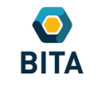

<table>
  <tr>
    <td width="110">
      
    </td>
    <td>
      <strong>Australian Research Centre for Behavioural Insights for Technology Adoption (ARC BITA)</strong>
    </td>
  </tr>
</table>

_**ARC BITA Geek Seminar Series** — a forum for practical, empirical methods and tooling for behavioural insights & technology adoption._

---

### Session Title
> End-to-End LLM-Integrated Agent-Based Modelling System for Social Simulation

### Presenter(s)
> Arian Mashhady, ARC Centre for Behavioural Insights for Technology Adoption (ARC BITA) at QUT

### Abstract
> This presentation introduces ongoing research focused on the development of an end-to-end LLM-integrated Agent-Based Modelling (ABM–LLM) system. The research covers the full modelling pipeline, beginning with synthetic population and profile generation, followed by the construction of behavioural information for LLM-driven agents, execution within a flexible simulation engine, and post-simulation analysis of agent decisions, interactions, and emerging patterns.
>
> The thesis contributes an integrated methodological framework that connects these stages within a single system, allowing researchers to construct heterogeneous social agents from population data, simulate their behaviour and interactions using LLMs, and systematically analyse the resulting behavioural and system-level outcomes.

### Prerequisites & setup
> - No software installation or prior coding experience is required. 
> - Some familiarity with language models, research data or network analysis may be helpful but is not essential.

### Agenda (indicative)
- 00:00–00:05 — Welcome & context  
- 00:05–01:25 — Main content/demo
- 01:25–01:30 — Wrap & resources

### Materials
- **Slides:** [link](./slides/)
- **Code/demo:** Not applicable.
- **Dataset(s):** Not applicable.

### Recording & transcript (post-session)
- **Recording:** [link](./recording/)
- **Transcript:** Not applicable.

### References & further reading
- Not applicable.

---

### Licensing & attributions
- **Content license:** CC BY 4.0
- **Code license:** MIT
- **Preferred citation:** Mashhady, A. (2026). "End-to-End LLM-Integrated Agent-Based Modelling System for Social Simulation", ARC BITA Geek Seminars, 2026-10-02.
- **Third-party assets:**  
  - Cited/attributed within slides.

---

### Changelog
- 2026-10-06: Slides shared by Arian Mashhady after the session.
- 2026-10-06: Create README.md file + upload of slides and recording (after editing) by Dr. Steve Bickley.

---

### About ARC BITA & contacts
Other ARC BITA updates are available on our [official website](https://arcbita.org/), [Working Paper Series](https://arcbita.org/publications), [Podcast Series](https://arcbita.org/podcast-1), [LinkedIn](https://www.linkedin.com/company/arc-ittc-bita/), and [YouTube](https://www.youtube.com/@ARCBITA).  

To discuss research or opportunities, please reach out via our [contact form](https://arcbita.org/contact).

Back to the repo home: [ARC BITA Geek Seminars Knowledge Hub](https://github.com/stevejbickley/arcbita-geek-seminars/tree/main)

